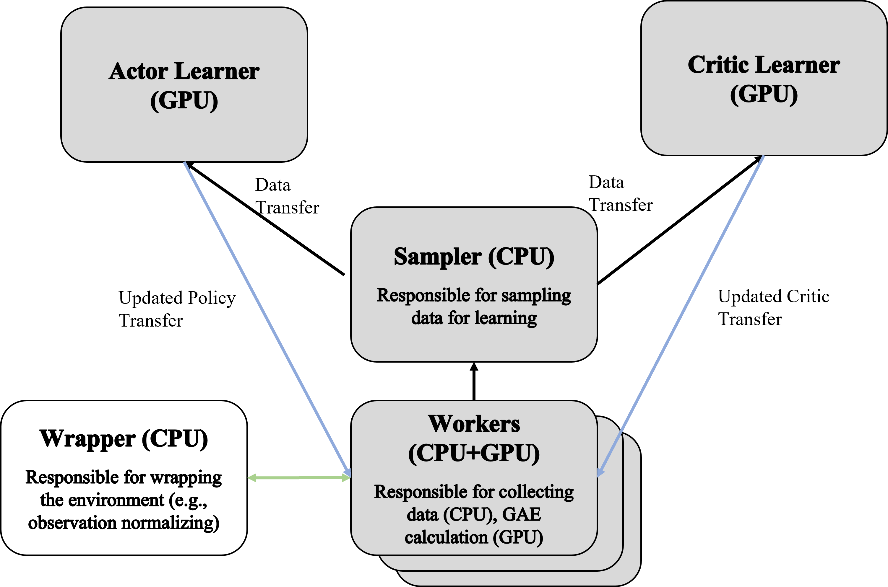

## <span style="color:violet">CO-GYM: High-Performance & Researcher-Friendly Reinforcement Learning Algorithm Suites </span>

### Features of CO-GYM?
* No explicit C/C++ code.
* All algorithms are written as independent ```.py``` files (easy to debug & modify).
* Supports various state-of-the-art algorithms: PPO, PPG, DDPG, TD3, SAC, and TQC.
* Various tricks not present in the original papers have been incorporated into the algorithms.
* Supports the **Dual Distributed Actor-Critic (D2AC) framework**, leading to strong performance of **on-policy** algorithms.

### What is the Dual Distributed Actor-Critic Architecture (D2AC)?
The Dual Distributed Actor-Critic (D2AC) framework is a novel framework designed to enhance the performance and scalability of on-policy reinforcement learning algorithms. D2AC leverages the following key components:

### Key Components of D2AC
1. **Distributed Learning**: D2AC employs a distributed learning approach where multiple worker nodes interact with the environment and collect data (on CPU). This data is then sent to a centralized learner which updates the policy and value networks (on GPU).

2. **Actor-Critic Separation**: In D2AC, the actor (policy) and critic (value) networks are separated and can be updated independently. This separation allows for more efficient learning and better scalability.

3. **Synchronous Updates**: All workers interacting with the environment use the same policy to collect data. This helps in improving the policy reliably. Synchronous policy updates are crucial for achieving better asymptotic performance compared to asynchronous update frameworks (e.g., IMPALA).

4. **Provides Environment Wrappers**: The architecture includes essential environment wrappers that facilitate observation normalization, reward scaling, and other preprocessing steps to improve the sample-efficient of the algorithms.

5. **High Performance**: The architecture is designed to maximize the use of CPU and GPU resources for faster training times. 

D2AC aims to provide a flexible and powerful framework for reinforcement learning that can handle a wide variety of tasks and environments with high efficiency and performance. Below is the overview diagram of D2AC.

<br/>

<p align="center">
  
</p>
<p align="center" style="font-size: 14px; color: gray;">Figure1. The diagram of the D2AC framework.</p>

- - -
### How to Run CO-GYM?

1. **Create an Environment**
```python
import co_gym
env = co_gym.make(env_id='Quadroter-v0')
```
2. **Choose an Algorith**
```python
algorithm = 'PPO'
```
3. **Load Trainer & Start Training**
```python
trainer = co_gym.load(env, algorithm=algorithm)
trainer.train()
```
That's it, simple!
Moreover, if you do not want to use the default configuration of the algorithm, you can change the configuration like this:

```python
my_config = {'n_workers': 32, 'policy_hidden_dims': [128, 128]}

trainer = co_gym.load(env, algorithm=algorithm, config=my_config)
trainer.train()
```

- - -
### Performance of CO-GYM

To evaluate the performance of the CO-GYM framework, we conducted an experiments using robotics simulation environments, which involve complex and high-dimensional continuous control tasks.

**Test System Specifications:**
- **CPU:** Intel i9-13900k
- **GPU:** NVIDIA RTX 4090

---

* **PPO (Proximal Policy Optimization)**

| **Environment** | **Return** | **Wall-time**  |
|:---------------:|:----------:|:--------------:|
|  Quadrotor-v0   |    682     |  420 seconds   |
|   Humanoid-v3   |    5618    |  350 seconds   |
|     Ant-v3      |    5095    |  240 seconds   |

<p align="center">
  
</p>
<p align="center" style="font-size: 14px; color: gray;">Figure2. Control of Quadrotor-v0 using PPO.</p>


* **TQC (Truncated Quantile Critic)**

| **Environment**    | **Return** | **Timesteps** |
|--------------------|------------|---------------|
| QuadInvPendulum-v0 | 902        | 1.4 M         |
| Humanoid-v3        | 9819       | 3 M            |
| Ant-v3             | 8521       | 3 M            |

<p align="center">
  
</p>
<p align="center" style="font-size: 14px; color: gray;">Figure3. Control of QuadInvPendulum-v0 using TQC.</p>

- - -
### Save & Load the Model

CO-GYM supports a model management system for saving and loading models.

#### Saving:

In CO-GYM, you can enable the saving of models and set the frequency (in epochs) of checkpoints.
The ```model_checkpoint_freq``` parameter in the configuration specifies the frequency at which checkpoints are saved.
The saved files will be located in the ```co_gym/log/your_checkpoint_dir``` folder.
The ```your_checkpoint_dir``` folder is automatically created based on the algorithm, environment and the execution time.
<br/>
Note that the model will only be saved if the ```save_model``` parameter in the configuration is set to ```True``` (which is the default setting).

In **on-policy algorithms** such as PPO, the saved files are as follows:
- **```co_gym/log```**
  - **```your_checkpoint_dir```**
    - **```checkpoint_1```**
      - **```checkpoint.pt```**: The model's state dictionary, which includes the neural network weights, biases, and the optimizer's state dictionary.
      - **```config.yaml```**: Configuration settings used for the training, such as hyperparameters and algorithm-specific options.
      - **```metadata.yaml```**: Metadata information about the training process, such as the epochs, return, and wall-time at the time of saving.
      - **```observation_normalizing_values.yaml```**: Values used for normalizing the observations during training.
      - **```policy.pt```**: The policy model's state dictionary, similar to ```checkpoint.pt``` but specifically for the policy network.
      - **```pickled_data```**
        - **```ObsRunningMeanVar_class.pickle```**: Pickle file containing the running mean and variance of the observations.
        - **```RetRunningMeanVar_class.pickle```**: Pickle file containing the running mean and variance of the returns.
    - **```checkpoint_2```**
    - **```checkpoint_3```**
    - **```...```**

These files are organized into checkpoint directories (e.g., `co_gym/log/your_checkpoint_dir/checkpoint_1`, `co_gym/log/your_checkpoint_dir/checkpoint_2`),
each representing the state of the training at different points in time.
Each checkpoint folder contains all the necessary files to resume training or perform evaluation from that point.

In **off-policy algorithms** such as SAC and TQC, the saved files are as follows:
- **```co_gym/log```**
  - **```your_checkpoint_dir```**
    - **```checkpoint_1```**
      - **```checkpoint.pt```**: The model's state dictionary, which includes the neural network weights, biases, the optimizer's state dictionary, and the <u>**buffer**</u>.
      - **```config.yaml```**: Configuration settings used for the training, such as hyperparameters and algorithm-specific options.
      - **```metadata.yaml```**: Metadata information about the training process, such as the epochs, return, and wall-time at the time of saving.
      - **```policy.pt```**: The policy model's state dictionary, similar to ```checkpoint.pt``` but specifically for the policy network.
    - **```checkpoint_2```**
    - **```checkpoint_3```**
    - **```...```**

The buffer included in ```checkpoint.pt``` is a replay memory commonly used in deep RL, and it can be very large (e.g., 100MB).
<br/>
Therefore, <u>**be careful**</u> not to set ```model_checkpoint_freq``` to too small a value.

#### Loading:

To load a saved model and continue training, add the ```load_model``` and ```load_checkpoint_dir``` parameters to the config argument of the ```co_gym.load``` method when loading the Trainer.
<br/>
Here is an example of loading a model:


```python
import co_gym
env = co_gym.make(env_id='Quadroter-v0')
algorithm = 'PPO'
my_config = {'load_model': True, 'load_checkpoint_dir': 'PPO_Hopper-v4_2024-07-15_23:37:55/checkpoint_3'}

trainer = co_gym.load(env, algorithm=algorithm, config=my_config)
trainer.train()
```
Note that to successfully load the model, other parameters in the configuration must **match** those of the saved model.

- - -
### Configuration
Below are the various configuration settings for the CO-GYM framework, including common configurations, specific algorithm configurations, environment wrapper settings, and evaluation and logging options.

**Configuration for <u>On-Policy</u> algorithms**

| **Parameter**             | **Default Value**                                      | **Description**                                             |
|---------------------------|--------------------------------------------------------|-------------------------------------------------------------|
| `random_seed`             | 1                                                      | Seed for random number generation                           |
| `n_workers`               | 32                                                     | Number of parallel workers                                  |
| `learner_device`          | 'cuda'                                                 | Device used for learning (e.g., 'cuda' for GPU)             |
| `worker_device`           | 'cpu'                                                  | Device used for workers (e.g., 'cpu')                       |
| `max_epochs`              | 60000                                                  | Maximum number of training epochs                           |
| `max_rollout`             | 512                                                    | Maximum number of steps per rollout                         |
| `max_grad_norm`           | 1.5                                                    | Maximum gradient norm for clipping                          |
| `batch_size`              | 512                                                    | Batch size for training                                     |
| `critic_hidden_dims`      | [64, 64]                                               | Hidden layer dimensions for the critic network              |
| `policy_hidden_dims`      | [64, 64]                                               | Hidden layer dimensions for the policy network              |
| `gamma`                   | 0.995                                                  | Discount factor for future rewards                          |
| `adam_eps`                | 0.00001                                                | Epsilon value for the Adam optimizer                        |
| `activation_fc`           | 'ELU'                                                  | Activation function used in fully connected layers          |
| `actor_lr`                | 0.0003                                                 | Learning rate for the actor network                         |
| `critic_lr`               | 0.0003                                                 | Learning rate for the critic network                        |
| `log_std_bound`           | [-20, 2]                                               | Bounds for the logarithm of the standard deviation          |
| `normalize_obs`           | True                                                   | Normalize observations                                      |
| `normalize_reward`        | True                                                   | Normalize rewards                                           |
| `clip_obs`                | false                                                  | Clip observations                                           |
| `obs_clip_range`          | 10                                                     | Observation clipping range                                  |
| `clip_reward`             | False                                                  | Clip rewards                                                |
| `reward_clip_range`       | 10                                                     | Reward clipping range                                       |
| `K_epochs`                | 3                                                      | Number of epochs per update                                 |
| `policy_clip_eps`         | 0.2                                                    | Clipping epsilon for policy loss                            |
| `gae_lambda`              | 0.95                                                   | Lambda parameter for Generalized Advantage Estimation (GAE) |
| `entropy_coef`            | 0.0                                                    | Coefficient for entropy bonus                               |
| `clip_value`              | False                                                  | Whether to clip value function updates                      |
| `value_clip_eps`          | 0.2                                                    | Clipping epsilon for value loss                             |
| `aux_update_freq`         | 32                                                     | Frequency of auxiliary updates (for PPG)                    |
| `aux_epochs`              | 6                                                      | Number of epochs for auxiliary phase (for PPG)              |
| `aux_batch_size_coef`     | 1.2                                                    | Coefficient for auxiliary batch size (for PPG)              |
| `bc_coef`                 | 1.0                                                    | Coefficient for behavior cloning loss (for PPG)             |
| `eval`                    | True                                                   | Enable evaluation                                           |
| `eval_freq`               | 50                                                     | Frequency of evaluation runs                                |
| `eval_episodes`           | 3                                                      | Number of episodes per evaluation run                       |
| `use_wandb`               | False                                                  | Enable Weights & Biases logging                             |
| `save_model`              | True                                                   | Enable model saving                                         |
| `model_checkpoint_freq`   | 500                                                    | Frequency of saving model checkpoints                       |
| `load_model`              | False                                                  | Whether to load a pre-trained model                         |
| `load_checkpoint_dir`     | e.g., 'PPO_Hopper-v4_2024-07-15_23:37:55/checkpoint_3' | Directory of the checkpoint to load                         |


<br/>

**Configuration for <u>Off-Policy</u> algorithms**

| **Parameter**             | **Default Value**                                      | **Description**                                                        |
|---------------------------|--------------------------------------------------------|------------------------------------------------------------------------|
| `random_seed`             | 1                                                      | Seed for random number generation                                      |
| `n_workers`               | 4                                                      | Number of parallel workers                                             |
| `learner_device`          | 'cuda'                                                 | Device used for learning (e.g., 'cuda' for GPU)                        |
| `worker_device`           | 'cpu'                                                  | Device used for workers (e.g., 'cpu')                                  |
| `max_epochs`              | 100000                                                 | Maximum number of training epochs                                      |
| `max_rollout`             | 25                                                     | Maximum number of steps per rollout                                    |
| `batch_size`              | 256                                                    | Batch size for training                                                |
| `critic_hidden_dims`      | [256, 256]                                             | Hidden layer dimensions for the critic network                         |
| `policy_hidden_dims`      | [256, 256]                                             | Hidden layer dimensions for the policy network                         |
| `gamma`                   | 0.99                                                   | Discount factor for future rewards                                     |
| `adam_eps`                | 0.00000001                                             | Epsilon value for the Adam optimizer                                   |
| `activation_fc`           | 'ReLU'                                                 | Activation function used in fully connected layers                     |
| `actor_lr`                | 0.0003                                                 | Learning rate for the actor network                                    |
| `critic_lr`               | 0.0003                                                 | Learning rate for the critic network                                   |
| `log_std_bound`           | [-20, 2]                                               | Bounds for the logarithm of the standard deviation                     |
| `noise_scale`             | 0.1                                                    | Noise scale for deterministic algorithms (DDPG, TD3)                   |
| `target_noise_clip`       | 0.5                                                    | Noise clipping for target policy smoothing in deterministic algorithms |
| `target_noise_scale`      | 0.2                                                    | Noise scale for target policy smoothing in deterministic algorithms    |
| `offline_buffer_capacity` | 1000000                                                | Capacity of the replay memory                                          |
| `update_after`            | 1000                                                   | Number of steps to collect before starting updates                     |
| `max_random_rollout`      | 10000                                                  | Maximum number of random steps for initial stage                       |
| `tau`                     | 0.005                                                  | Smoothing coefficient for target network                               |
| `temperature_lr`          | 0.0003 (for SAC & TQC)                                 | Learning rate for temperature parameter                                |
| `n_critics`               | 5 (for TQC)                                            | Number of critic networks                                              |
| `n_quantiles`             | 25 (for TQC)                                           | Number of quantiles                                                    |
| `n_drop_atoms`            | 2 (for TQC)                                            | Number of atoms to drop                                                |
| `eval`                    | True                                                   | Enable evaluation                                                      |
| `eval_freq`               | 200                                                    | Frequency of evaluation runs                                           |
| `eval_episodes`           | 5                                                      | Number of episodes per evaluation run                                  |
| `use_wandb`               | False                                                  | Enable Weights & Biases logging                                        |
| `save_model`              | True                                                   | Enable model saving                                                    |
| `model_checkpoint_freq`   | 10000                                                  | Frequency of saving model checkpoints                                  |
| `load_model`              | False                                                  | Whether to load a pre-trained model                                    |
| `load_checkpoint_dir`     | e.g., 'SAC_Hopper-v4_2024-07-15_23:45:27/checkpoint_2' | Directory of the checkpoint to load                                    |

- - -
### Dependencies
Make sure to install these dependencies to ensure the proper functioning of the ```co_gym``` package.

```python
python>=3.8, <3.11
gymnasium>=0.17.2
torch>=1.7.0
numpy>=1.16.0
wandb
pyyaml
pandas
mujoco-python-viewer
```
